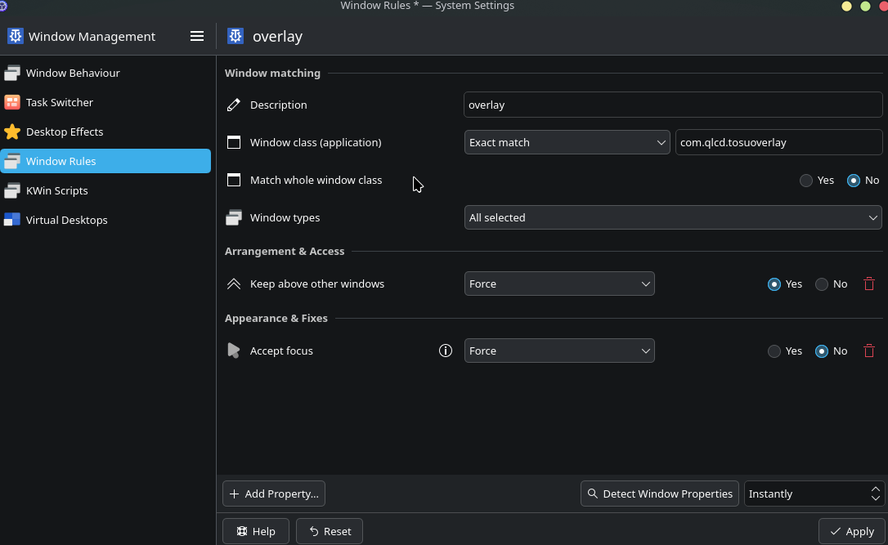

# linux-tosu-ingame-overlay
[中文](README_CN.md)|English

A tosu/gosumemory in-game overlay for Linux.

## Notice
This overlay is compatible only with KDE Plasma and has been tested exclusively on osu-winello (osu!stable) and Arch Linux. Compatibility with osu!lazer and other Linux distributions is uncertain.

## Known Issues
- The overlay does not function correctly when the game is set to fullscreen mode (whether native or borderless). Currently I have no idea how to fix that, so the overlay is limited to windowed mode only.
- The auto show/hide function may be kinda slow due to the inefficient method used to fetch osu! window data, which relies on a polling cycle of 500ms.

## How to Use

### 1. Install Dependencies

#### Arch Linux:
```bash
sudo pacman -Syu --needed gtk4 webkit2gtk python-gobject python-cairo gtk-layer-shell qt5-tools
```

#### Debian/Ubuntu (not tested, but expected to work):
```bash
sudo apt install -y python3-gi python3-gi-cairo gir1.2-gtk-4.0 gir1.2-webkit2-6.0 libwebkit2gtk-6.0-0 libgtk-4-1 libgtk-layer-shell-1.0-0
```

### 2. Download and Extract
Download the `.zip` file from the Release page and extract it to anywhere you like.

### 3. Configure Window Rules
Open **System Settings**, go to **Window Management** and then **Window Rules**. Click **Add New** and configure the settings as shown below:

Don't forget to click **Apply** after completing the configuration.

### 4. Customize the Overlay
Edit the `src/index.html` file to customize your overlay. Imagine a 1920x1080 canvas and place fixed elements on it using something like `</iframe>`. The default file includes the [osumania_map_analyser](https://github.com/LeoBlackMT/osumania_map_analyser/tree/main) created by [Leo_Black](https://github.com/LeoBlackMT) (which is an excellent tool for mania players)

### 5. Run the Application
Open osu! and run the application using the following command:
```bash
./tosuoverlay
```