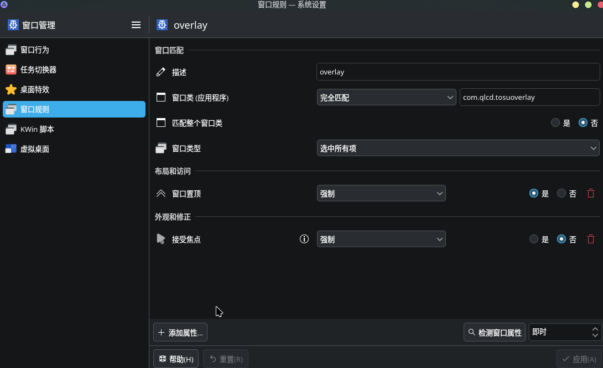

# linux-tosu-ingame-overlay

中文|[English](README.md)

这是一个适用于Linux平台的tosu/gosumemory游戏内overlay

## 注意事项
该软件仅支持KDE Plasma并且只在Arch Linux和osu-winello(osu!stable)上测试过。我不知道在lazer和其它发行版上能不能用。

## 已知问题
- 全屏模式时overlay无法显示，就算是无边框窗口也不行。我暂时没有找到解决的办法。
- 自动显示/隐藏的功能比较慢，因为读取osu窗口状态的方法很蠢并且轮询周期高达500ms。

## 如何使用

### 1. 安装依赖

#### Arch Linux:
```bash
sudo pacman -Syu --needed gtk4 webkit2gtk python-gobject python-cairo gtk-layer-shell qt5-tools
```

#### Debian/Ubuntu (没测试过，应该能用):
```bash
sudo apt install -y python3-gi python3-gi-cairo gir1.2-gtk-4.0 gir1.2-webkit2-6.0 libwebkit2gtk-6.0-0 libgtk-4-1 libgtk-layer-shell-1.0-0
```

### 2. 下载软件
从Release界面下载`.zip`文件并且解压到你喜欢的地方。

### 3. 设置窗口规则
打开**系统设置--窗口管理--窗口规则**然后按如图所示配置：

配置完了别忘记点应用。

### 4. 自定义overlay
编辑`src/index.html`来自定义overlay。想象这是一个1920x1080的画布然后用`</iframe>`之类的东西添加你想要的固定元素。默认的`index.html`包含[Leo_Black](https://github.com/LeoBlackMT)大佬的[osumania_map_analyser](https://github.com/LeoBlackMT/osumania_map_analyser/tree/main)。

### 5. 运行程序
打开osu!并确保tosu/gosumemory正常运行，然后运行:
```bash
./tosuoverlay
```